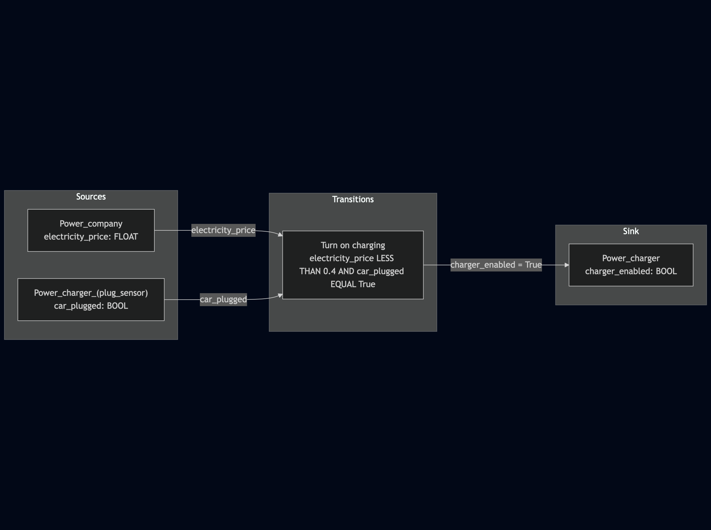

# LLM TAP (Trigger-Action Programs)

`llm-tap` is a lightweight and extensible library to generate workflows using Large Language Models (LLMs). `llm-tap` provides mechanisms and data structures to generate workflows and constraints for any existing workflow engine.

`llm-tap` is *not* a workflow library but should be used to design a workflow generator with LLMs.

## Installation

Installation shall be done from source to build a local package. This requirement is tied to a customized version of `llama-cpp-python`.

```
https://github.com/advanced-stack/llama-cpp-python.git
Branch: feature/ranking
```

To build a package:

```
git clone https://github.com/advanced-stack/llm-tap.git

cd llm-tap
make setup
make build  # build a redistribuable package for llm-tap in ./dist/
```


Then you can pip install in your project:

```
pip install /path/to/llm-tap/dist/llm_tap-0.2.0.tar.gz
```


## Quickstart

Let's take an example to generate a workflow based on the following user query:

> *When the electricity price is below $0.4/ kWh and my Tesla is plugged, turn on charging.*

To generate a workflow, `llm-tap` uses Colored Petri Nets to describe the different components.


```python
from llm_tap import llm
from llm_tap.models import (
    SOURCE,
    SINK,
    Workflow,
    Place,
    TokenType,
    instructions,
    register_place,
    register_token_type,
    get_places,
)

remaining_range = TokenType(name="remaining_range", type="INT")
charger_enabled = TokenType(name="charger_enabled", type="BOOL")
car_plugged = TokenType(name="car_plugged", type="BOOL")
electricity_price = TokenType(name="electricity_price", type="FLOAT")


register_token_type(remaining_range)
register_token_type(charger_enabled)
register_token_type(car_plugged)
register_token_type(electricity_price)

register_place(
    Place(
        name="Power company",
        description="Provides current electricity price",
        type=SOURCE,
        token_type=electricity_price,
    )
)

register_place(
    Place(
        name="Power charger (plug sensor)",
        description="Provides the status of the plug",
        type=SOURCE,
        token_type=car_plugged,
    )
)

register_place(
    Place(
        name="Power charger",
        description="Charge electric vehicles",
        type=SINK,
        token_type=charger_enabled,
    )
)

register_place(
    Place(
        name="EV monitoring system (range)",
        description="Provides the remaining range in miles",
        type=SOURCE,
        token_type=remaining_range,
    )
)

system_prompt = instructions
prompt = """When the electricity price is below $0.4/kWh and my Tesla
is plugged, turn on charging."""

model = "~/.cache/py-llm-core/models/llama-3.1-8b"

with llm.LLamaCPP(model=model, n_ctx=8_000) as parser:
    workflow = parser.parse(
        data_class=Workflow,
        prompt=prompt,
        system_prompt=system_prompt,
    )
    print(workflow)
```


This prints the following result:

```python


```

Then we can generate a mermaid graph:

```python
from llm_tap.to_mermaid import workflow_to_mermaid

print(workflow_to_mermaid)
```

```plain
flowchart LR
    subgraph Sources
        Power_charger__plug_sensor_[Power_charger_#40;plug_sensor#41;<br/>car_plugged: BOOL]
        Power_company[Power_company<br/>electricity_price: FLOAT]
    end
    subgraph Sink
        Power_charger[Power_charger<br/>charger_enabled: BOOL]
    end
    subgraph Transitions
        Turn_on_charging[Turn on charging<br/>electricity_price LESS THAN 0.4 AND car_plugged EQUAL True]
    end
    Power_company -->|electricity_price| Turn_on_charging
    Power_charger__plug_sensor_ -->|car_plugged| Turn_on_charging
    Turn_on_charging -->|charger_enabled = True| Power_charger
```




## Additional resources

Currently work in progress here: https://advanced-stack.com/resources/how-to-build-workflows-trigger-action-program-with-llms.html
